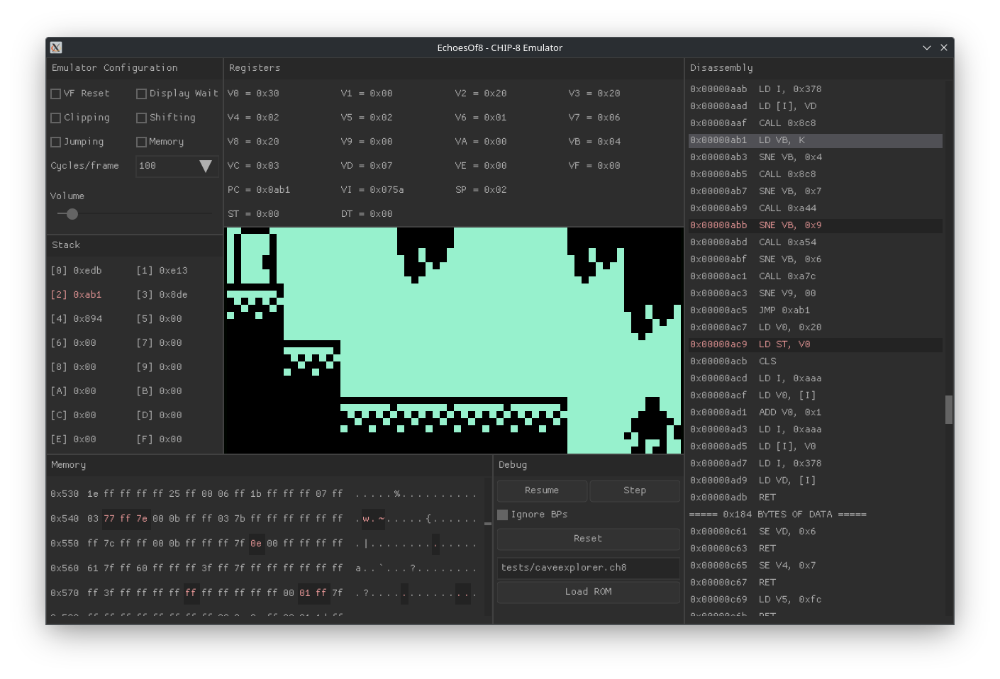

# EchoesOf8 - A [CHIP-8](https://en.wikipedia.org/wiki/CHIP-8) Emulator



> [!WARNING]
> This emulator does not support the expanded SUPER CHIP/CHIP-48 instruction set.

## Features

- Full CHIP-8 support, including quirks, graphics, and sound.
- Quirks can be toggled as needed.
- The speed of the emulator is adjustable (cycles per frame).
- Debug UI (press `h` to toggle it, and `space` to pause/unpause).
- Can load ROMs at runtime and reset the emulator's state.
- Support for instruction and memory (read/write) breakpoints.
- Uses recursive descent disassembly and updates it at runtime based on memory  
  modifications and `JMP V0, addr` instructions.
- Additional utilities include an assembler, recursive descent and  
  linear disassemblers, and a hexdumper.

## Building

```bash
# Install dependencies
## Ubuntu
sudo apt install libsdl2-dev
## Fedora
sudo dnf install SDL2-devel
## macOS
brew install SDL2

# Build the project
./build.sh
```

## Usage

```bash
# Run the emulator
./build/eo8 <rom>

# Debug mode
./build/eo8 <rom> --debug
```

> [!NOTE]
> On macOS, you'll likely get a security error about the SDL2 framework.
> You can accept the warning by going to `Settings > Privacy & Security`,
> scrolling down, and clicking `Allow` for the security warning.
> When you re-run the executable, you'll be allowed to proceed.

The left side of the keyboard has been allocated as the keypad for the CHIP-8,
e.g., the following keys on a QWERTY layout:

| 1 | 2 | 3 | 4 |
|---|---|---|---|
| Q | W | E | R |
| A | S | D | F |
| Z | X | C | V |

There are various ROMs you can try in the `tests` folder.

## Acknowledgements

A collection of the resources I used during development that helped a lot.

- Test ROM from [corax89/chip8-test-rom](https://github.com/corax89/chip8-test-rom)
- [CHIP-8 Instruction Set](https://github.com/mattmikolay/chip-8/wiki/CHIP%E2%80%908-Instruction-Set)
- [Cowgod's Chip-8 Technical Reference](http://devernay.free.fr/hacks/chip8/C8TECH10.HTM)
- [CHIP-8 test suite](https://github.com/Timendus/chip8-test-suite)
- [Octo](https://github.com/JohnEarnest/Octo)
- [Lazy Foo' Productions - Beginning Game Programming v2.0](https://lazyfoo.net/tutorials/SDL/)
- [Chip-8 Program Pack](https://github.com/dmatlack/chip8/tree/master/roms)
